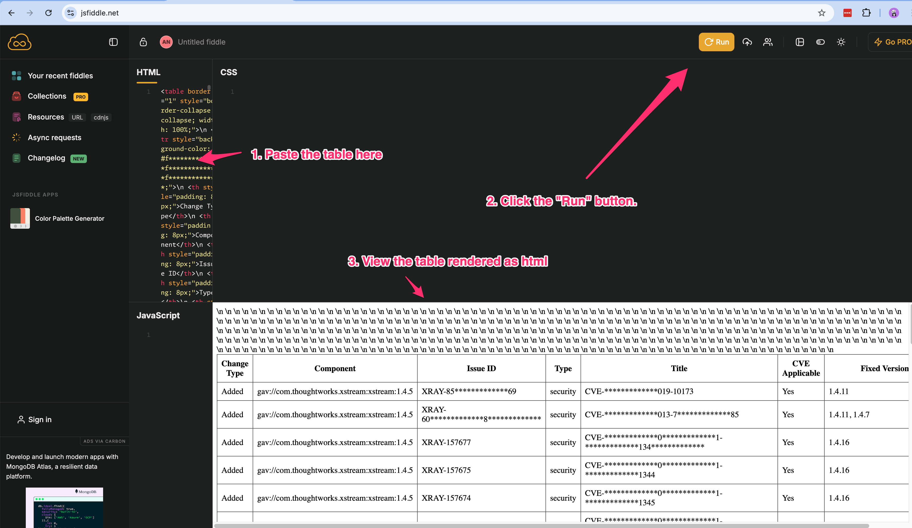

# Build Diff Vulnerability Compare Worker

This worker compares security vulnerabilities between two build jobs (runs of a build) using Xray UI API "https://your-instance.jfrog.io/ui/api/v1/xray/ui/security_info/diff"  and generates an HTML report of the differences.

**Note**: This is different from the Artifactory REST API [Builds Diff](https://jfrog.com/help/r/jfrog-rest-apis/builds-diff) the compares build artifacts/dependencies/environment between two build jobs (runs of a build) 

## Features

- Compares vulnerabilities between current build and a previous build
- Configurable which previous build to compare against (nth previous build)
- Generates an HTML table showing added, removed, and changed vulnerabilities
- Shows CVE applicability status and fixed versions
- Project-aware build comparison

## Configuration

### Required Secrets

The worker requires the following secrets to be configured:

1. `adminGroupName` - The admin group name for generating access tokens
2. `buildDiffUrl` - The URL for the Xray security info diff endpoint (e.g., "https://your-instance.jfrog.io/ui/api/v1/xray/ui/security_info/diff")
3. `projectKey` - The project key (e.g., "cg-lab")
4. `prev_n_build_run_to_compare` - Which previous build to compare against (e.g., "2" for comparing with 2 builds ago)

### Setting Up Secrets

Use the JFrog CLI to configure the secrets:
```
jf worker add-secret --edit adminGroupName --server-id psazuse
jf worker add-secret buildDiffUrl --server-id psazuse
jf worker add-secret projectKey --server-id psazuse
jf worker add-secret --edit prev_n_build_run_to_compare --server-id psazuse
```

This will add encrypted secrets to your manifest.json:

```json
{
  "secrets": {
    "adminGroupName": "6VfWgfhAC5Me0==",
    "buildDiffUrl": "9sm3KiI+WA==",
    "prev_n_build_run_to_compare": "/SECcwIYJXudt3Eg==",
    "projectKey": "hvq56msDlhTmaYDEzWldwBXQd"
  }
}
```

## Deployment

After making changes to the worker code, redeploy using:

```bash
jf worker deploy --server-id psazuse
```

You will be prompted for the secret used for encrypting the secrets in manifest.json.

## Testing

1. Navigate to the worker configuration in the UI: `https://example.jfrog.io/ui/admin/workers/sv-builddiff-vul-compare/edit`

2. Modify the test payload to use your build details:
```json
{
  "build": {
    "name": "cg-mvn-base-webgoat",
    "number": "2025-03-04_10-16-43",
    "buildRepo": "cg-lab-build-info",
    ...
  }
}
```
For example:
```
{
  "build": {
    "name": "cg-mvn-base-webgoat",
    "number": "2025-03-04_10-16-43",
    "started": "1980-01-01T00:00:00.000+0000",
    "buildAgent": "GENERIC/1.00.0",
    "agent": "jfrog-cli-go/1.00.0",
    "durationMillis": 1000,
    "principal": "bob",
    "artifactoryPrincipal": "artifactoryPrincipal",
    "url": "url",
    "parentName": "parentName",
    "parentNumber": "parentNumber",
    "buildRepo": "cg-lab-build-info",
    "modules": [
```

3. The worker will generate:
   - A curl command for troubleshooting HTTP 500 errors
   - An HTML table showing the vulnerability differences

### Viewing Results

The HTML table output can be viewed by:
1. Copy the HTML table from the "Execution Logs"
2. Paste it into https://jsfiddle.net/
3. Run to see the formatted vulnerability comparison

## Troubleshooting

If you encounter HTTP 500 errors, use the generated curl command from the logs to test the API directly:
```bash
curl -X POST 'https://example.jfrog.io/ui/api/v1/xray/ui/security_info/diff' \
  -H 'Content-Type: application/json' \
  -H 'X-Requested-With: XMLHttpRequest' \
  -H 'Accept: */*' \
  -H 'Cookie: __Host-REFRESHTOKEN=*;__Host-ACCESSTOKEN=YOURTOKEN' \
  -d '{"old":{"type":"build","component_id":"build://[cg-lab-build-info]/cg-mvn-base-webgoat:build-diff-v1","package_id":"build://[cg-lab-build-info]/cg-mvn-base-webgoat","path":"","version":"build-diff-v1"},"new":{"type":"build","component_id":"build://[cg-lab-build-info]/cg-mvn-base-webgoat:2025-03-04_10-16-43","package_id":"build://[cg-lab-build-info]/cg-mvn-base-webgoat","path":"","version":"2025-03-04_10-16-43"}}'
```


## Output Format

The worker generates an HTML table showing:
- Change Type (Added/Removed/Changed)
- Component
- Issue ID
- Issue Type
- Title
- CVE Applicability
- Fixed Versions

```html
<table border="1" style="border-collapse: collapse; width: 100%;">
  <tr style="background-color: #f2f2f2;">
    <th>Change Type</th>
    <th>Component</th>
    ...
  </tr>
  ...
</table>
```
To render the HTML table, copy the HTML table from the "Execution Logs" and paste it into https://jsfiddle.net/

Example rendered output:



This README provides:
1. Overview of the worker's functionality
2. Setup instructions
3. Deployment steps
4. Testing procedures
5. Troubleshooting guidance
6. Output format details
